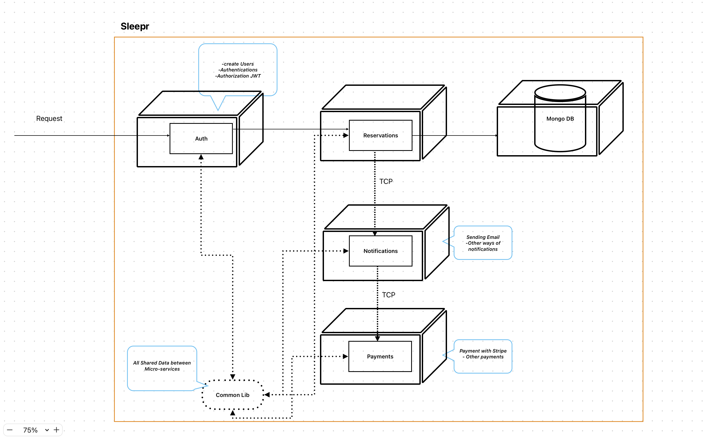

<p align="center">
  <a href="http://nestjs.com/" target="blank"></a>
</p>

## Description

Scalable [NestJS](https://github.com/nestjs/nest) Application


## Installation

```bash
$ docker-compose build
```

## Running the app

```bash
# development
$ docker-compose up

```

## Running Each App

navivate to each app directory

```bash
# build
$ docker build ../../ -t sleepr_microServiceName -f ./Dockerfile

# without bash
$ docker run --env-file=.env sleepr_microServiceName

# with bash
$ docker run -it --env-file=.env sleepr_microServiceName /bin/bash
```

## Test

navigate to e2e directory

```bash
# tesing
$ docker-compose up e2e

# building
$ docker-compose up e2e --build

# get log of each service
$ docker container logs containerName
```
